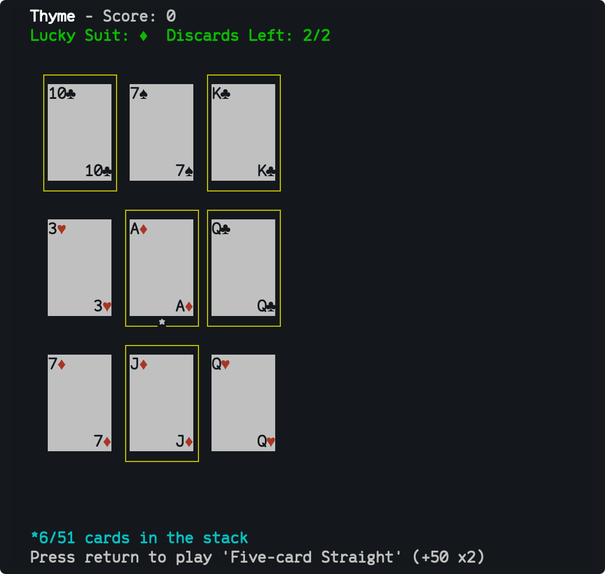

# Thyme 

A command-line interface implementation of [Sage Solitaire](http://sagesolitaire.com).

# Installation

## Homebrew

    brew install kattrali/formulae/thyme --HEAD

## Source

### Dependencies

Thyme is written in [Rust](http://rust-lang.org), and built using version
1.3.0. It depends on [ncurses](https://www.gnu.org/software/ncurses) 6.0.

### Building

Run `make install` to install thyme to `/usr/local/bin`, or use `DESTDIR` to specify
an alternate location:

    DESTDIR=/some/directory make install

# Usage

Run `thyme`. Use the directional keys to move the card selection cursor and
press the spacebar to toggle card selection. Select a set of cards to make a
hand, then press return to play the move. A single card may occasionally be
selected as a discard move. The goal is to clear all cards from the board.

## Keys

* Arrow keys or WASD: Move the cursor
* Q: Quit game
* Space: Toggle card selection
* Return: Play card selection as a hand

## Hands

* Straight Flush: Five consecutive cards of the same suit
* Four of a Kind: Four cards with the same value
* Flush: Five cards with the same suit
* Full House: Three cards with the same value and two cards with the same value
* Five-card Straight: Five consecutive cards of various suits
* Three of a Kind: Three cards with the same value
* Three-card Straight: Three consecutive cards of various suits
* Pair: Two cards with the same value
* Trash: Discard a single card
